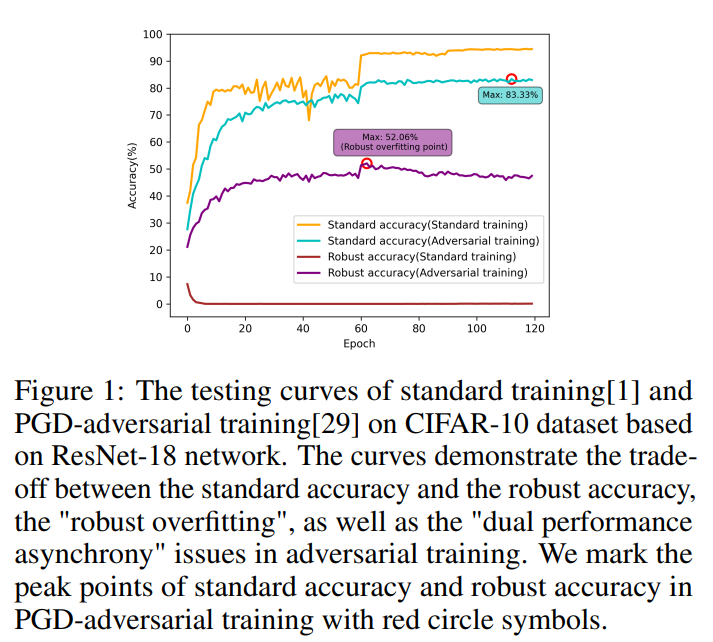
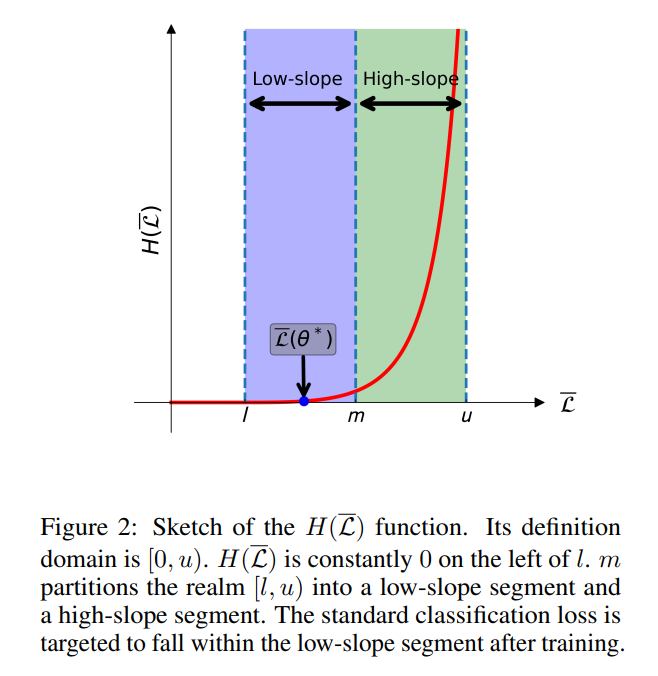

# Reconcile Accuracy and Robustness by Adaptive Ratio Adversarial Training
## Introduction
In this study, we investigated the phenomenon of the different synchronisation of Robust Accuracy (RA) and Standard Accuracy (SA) from the perspective of training loss (Figure 1). We found that regardless of the weight values chosen, there exists a trade-off between robustness and accuracy at a fixed ratio. Based on this, we have developed a new method called Adaptive Ratio Adversarial Training (AdaRAT), which utilises a novel radial unbounded barrier function to enhance the adversarial training loss (Figure 2), enabling the ratio between standard classification loss and the regularizer to adapt to the training progress. AdaRAT synchronises the peak performance of RA and SA, alleviating the trade-off between robustness and accuracy.

<div align=center>

</div>

## Environment
* Python (3.9.18)
* Pytorch (2.1.2)
* torchvision (0.16.2)
* torchattacks(3.5.1)
* CUDA(12.2)
* Numpy(1.24.1)

## Folder contents
* ```AdaRAT/models```:
